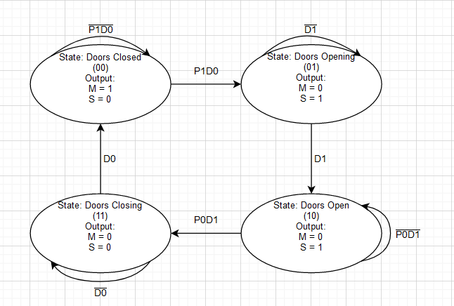

# FSMOptional
## 1. Please choose a real system that can be modelled by an FSM.
The model i am choosing for this system is an automatic door system. The automatic door system i am designing will have four states representing the different possible states of the door (open, closed, opening, closing) and transitions between states triggered by sensor inputs. In this FSM, the door may transition from the closed state to the opening state when a sensor detects a person approaching and when the door is fully closed, and from the opening state to the open state when the door reaches its fully open position. Similarly, the door may transition from the open state to the closing state when the sensor no longer detects a person for a certain amount of time and when the door is fully open, and from the closing state to the closed state when the door reaches its fully closed position.
## 2. Please design the model using: FSM, state and transition table, as well as the Karnaugh Map
### FSM Diagram

In the diagram above, there are 4 states, 2 input buttons, and 2 outputs. The input buttons are P and D, where P represents a person detector in an automatic door sytem (if P is 1 then a person is detected) while D represents the timer of the door to close/open (if D is 1 then the timer is complete). The outputs are M and S, where M represents if the door is moving or not (if M is 1 the door is moving), while S represents the status of the door (open/opening is 1 while closed/closing is 0).
