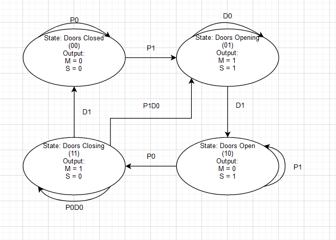
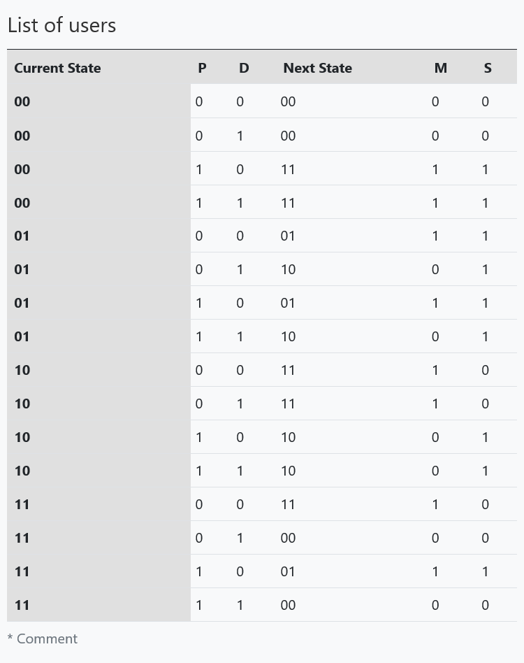

# FSMOptional
Name: Abdullah Akmal Sutoyo

Class: L1BC

NIM: 2602239320

## 1. Please choose a real system that can be modelled by an FSM.
The model i am choosing for this system is an automatic door system. The automatic door system i am designing will have four states representing the different possible states of the door (closed (00), opening (01), open (10), closing(11)) and transitions between states triggered by sensor inputs. In this FSM, the door may transition from the closed state to the opening state when a sensor detects a person approaching, and from the opening state to the open state when the time it takes to fully open the door have passed. Similarly, the door may transition from the open state to the closing state when the sensor no longer detects a person for a certain amount, and from the closing state to the closed state when the time it takes to close the door have passed. The closing state can also go back to the opening state if the time it take to close the door haven't passed and a person is detected by the sensor. Acting as sensors are the input buttons are P and D, where P represents a person detector in an automatic door sytem (if P is 1 then a person is detected) while D represents the timer of the door to close/open (if D is 1 then the timer is completed). The outputs are M and S, where M represents if the door is moving or not (if M is 1 the door is moving), while S represents the status of the door (open/opening is 1 while closed/closing is 0).

## 2. Please design the model using: FSM, state and transition table, as well as the Karnaugh Map
### FSM Diagram

### State and transition table

### Karnaugh Map
- ##### Next State (s0') Karnaugh Map

- ##### Next State (s1') Karnaugh Map

- ##### Output (M) Karnaugh Map

- ##### Output (S) Karnaugh Map

## 3. Derive combinatorial boolean equations from K-map
- #### Next State (s0) Karnaugh Map
s0' = s0s̅1 + s̅0s1D + s0P̅D̅ 
- #### Next State (s1) Karnaugh Map
s1' = s1D̅ + s̅0s̅1P + s0s̅1P̅
- #### Output(M) Karnaugh Map
M = s1D̅ + s̅0s̅1P + s0s̅1P̅
- #### Output(S) Karnaugh Map
S = s̅0s1 + PD̅ + s̅0P + s̅1P

## 4. Simulate the system in C with the equation that you just derived
I ran the code by using gcc manually.

![]

In the code i made, the state on the FSM starts at the doors closed (00) state. Below are all the possible outcomes that you can give
- ### Doors closed state (00)
![]

![]
- ### Doors opening state (01)
![]

![]

- ### Doors open state (10)
![]

![]

- ### Doors closing state (11)
![]

![]

![]
- ### Extras
![]

